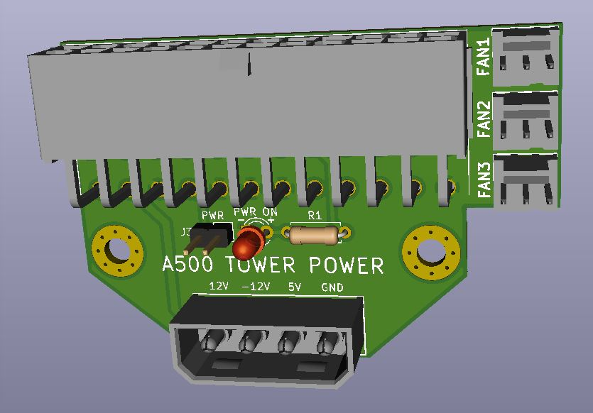

# A500 Tower Power
A small ATX to Amiga 500 power adapter for towerized A500 builds. Includes 3 fan connectors.

## Intro
I developed this adapter for my Amiga 500 tower project. It mounts to the motherboard tray or any other convenient area inside the case via two standoffs. It allows you to plug in a standard ATX power supply and provides a 4-pin molex connector (for the A500 power connector) along with 3 standard fan headers. 

## Assembly / Installation
* Order the PCB from your fabricator of choice. (JLCPCB, PCBway, OSH Park, etc.) This is a 4-layer PCB, so JLCPCB will probably be cheapest.
* Order the parts per the BOM. Mouser part numbers are included. A standard 2-pin 2.54mm pin header, 3mm LED, and a standard resistor are also needed, but who doesn't have those laying around?
* Solder the J3 pin header, LED, and resistor first.
* Solder the 4-pin molex, 24-pin ATX header, and the 3-pin fan headers.
* Obtain an A500 power connector either from a failed power supply or order a new connector.
* From an old ATX power supply, molex passthrough, or molex splitter, clip the leads of a 4-pin molex so you have only the female end with long leads.
* Strip and tin the leads of the 4-pin molex cable and solder them into the Amiga 500 power connector, paying close attention to pinouts of both the A500 and this power adapter board. (heatshrink the wires if necessary at this step)
* Plug the A500 to 4-pin molex dongle into the A500 Tower Power adapter.
* Mount the power adapter in a conventient location in your case, then plug in all the power connectors. The 2-pin PWR switch is for a standard toggle switch (or latching push button) for controlling the ATX power supply on/off function. I recommend swapping out ATX case power button with a latching push button if you can find one that works for you.
* Power on the Amiga Tower and enjoy.

## Misc
This is an open source design. Feel free to do what you want with it.
